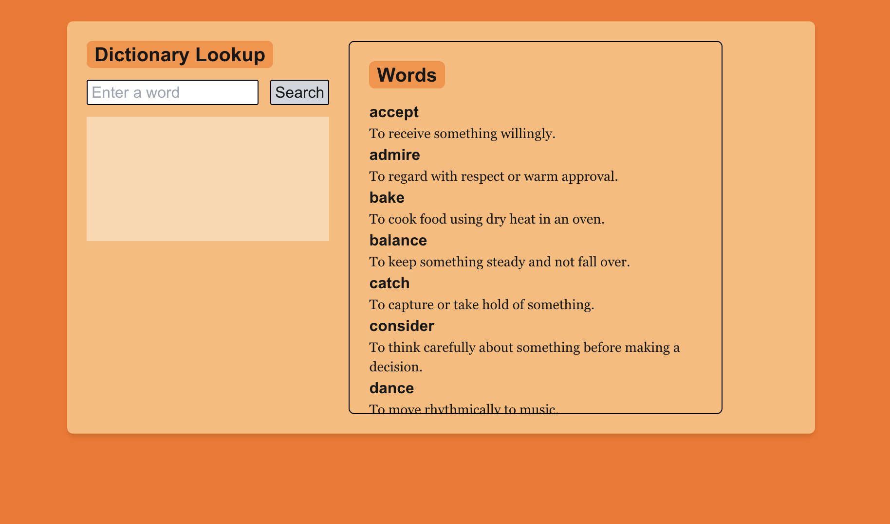

Here's a sample README file for your GitHub project.

---

# Simple Dictionary App

This is a simple dictionary application built with React.js. The app provides a basic search functionality that uses a **binary search algorithm** to look up definitions for words. This project uses a small set of dummy data stored in `data.js` and only utilizes React for the frontend and binary search for efficient word searching.

## Project Features

- **React.js** for the user interface.
- **Binary Search Algorithm** for fast word lookup.
- A simple, scrollable list of words and definitions.
- A search bar to input words and get definitions instantly.

## How Binary Search is Used in This Project

Binary search is a classic algorithm that efficiently finds an element in a sorted list. In this dictionary app, binary search allows for rapid word lookups by repeatedly dividing the search interval in half.

Here's how it works in this project:

1. The words in the dictionary are sorted alphabetically.
2. When you enter a word and click **Search**, the app performs a binary search on the sorted list.
3. If the word is found, its definition is displayed; if not, the app shows a "Word not found" message.

Binary search has a time complexity of \( O(\log n) \), making it a very efficient choice for this application, especially as the dictionary size grows.

## How to Run the Project

1. Clone this repository:
   ```bash
   git clone
   ```
2. Install dependencies:
   ```bash
   npm install
   ```
3. Start the application:
   ```bash
   npm start
   ```
4. Open your browser and navigate to `http://localhost:3000` to view the app.

## Project Structure

- `data.js`: Contains the list of dictionary words and their definitions.
- `dictionaryList.js`: Renders the dictionary as a scrollable list.
- `binarySearch.js`: Implements the binary search function for word lookup.
- `page.js`: Main page component that includes the input field and search functionality.

## Screenshots



## License

This project is licensed under the MIT License.

---

This README file provides an overview of your project and instructions on how to use it. You can also add any additional information, such as screenshots or links, as needed.
